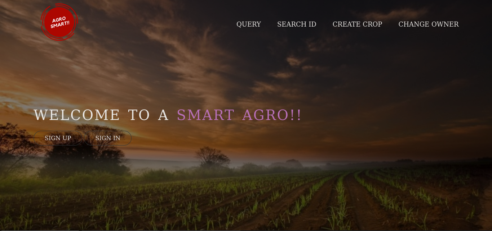

# Smart-Agro
> A blockchain enabled agro-based e-commerce website.

## Table of Contents
 -  General Info
 -  Technologies
 -  Installation

## General Info
Agro-smart is a suitable blockchain based web platform for farmers to buy and sell their agricultural goods without the interruption of any intermediaries.Blockchain and a smart contract enabled with Hyperledger-Fabric provides a secure way of storing and managing data, which facilitates the development and use of data-driven innovations for smart farming and smart index-based agriculture insurance.This project features
-   Farmers or Govt. can buy and sell agricultural goods without the intervention of any intermediaries.
-   Can track their sold and bought goods.
-   All the data is stored in Blockchcain.

## Technologies
-   Hyperledger-Fabric
-   GoLang
-   Node.js
-   Javascript
-   Docker
   
## Installation

### Pre-requisite
-  install GoLang from https://golang.org/doc/install
-  install Docker from https://www.docker.com/products/docker-desktop
-  install Docker-compose from https://docs.docker.com/compose/install/
-  install Nodejs from https://nodejs.org/en/

After installing these pre-requisites you're good to go.Just follow these commands below

```sh
cd fabcar/javascript/
./setNetwork.sh
npm start
```
## Screenshot



  
